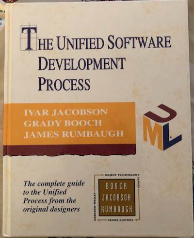
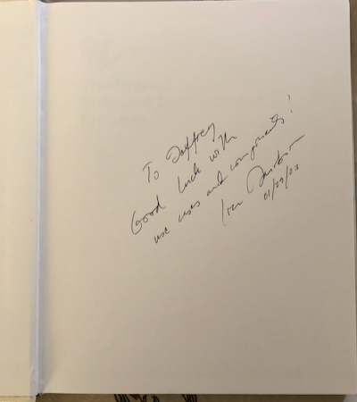

# Application Context

What we've created is a description of an Application Context in the form of a 3-dimensional
tuple also known as a trigram.  We want to use that trigram as the basis for extending the
functionality of our Platform, by:

1. Building the base set of Features to the Platform to produce a Product Line
2. Opening up the Extension mechanism to our Partners and Integrators to build on top of the Platform and enhance our Products

## Actions

While CRUD has dominated your career in building data-centric applications, you've also worked
within Frameworks where the basics of CRUD operations was a limiting factor.  You've somewhat
solved for this in your new model by treating Relationships as first-class citizens, and with the
introduction of Perspectives allowing you to target different views and formats of Entities and
Relationships within the Platform's Matrix Model.  But it's not enough to overcome the following
questions that still plague dealing with basic CRUD operations as the distinct set of operations,
such as:

* where does _search_ fit in the standard Read operation?
* does Read pertain to both fetching a single Entity as well as a list of Entities?
* are all Updates the same?
* is a Soft Delete an Update or a Delete?
* is a CRUD operation really the same thing at every point in an Application, from Client to API to database?

These and other questions, along with fights you've had with several ORM-based rapid development
frameworks to build features beyond basic CRUD functions help you realize and decide that you
need to move beyond a simplistic set of operations to allow for a more flexible way of looking at
what developers need in order to operate on Entities and Relationships from any different
Perspective.

So you change the Matrix Model to be more flexible using Action to capture what is happening to
an Entity or a Relationship at any given time.  Moving beyond CRUD to have a descriptive set of Actions that pertain to the Application being built allows those Actions to communicate more to
developers and integrators.

## State Machine

Another bit of knowledge gained from your experience that you're now building upon is the concept
that all Applications represent some type of State Machine, with some more complex than others.
Often times these State Machines are nested.

By considering our Matrix Model as a set of not only things our Application
needs to be able to do, but also as a set of States that represent distinct contexts within which a User of our Application
can enter or move through, you open up the door to more.

Stepping back from a simple
Client-Server Application of Request/Reply to focus on the Platform idea, you start to focus on how Users _experience_ our
Applications and how our _**Applications experience our Users**_ interacting with it at all
levels regardless of how that is accomplished.  You recognize that any Application is a State
Machine with Application Contexts representing the state at any given moment.  You also see
that the totality of the state of an Application at any given moment in time is the aggregation
of a set of Application Contexts that the User is currently experiencing or the User has
initiated within the Application, e.g. a User can be Viewing a Folder in the Admin while also
Adding Content to that Folder.

With this Model you see the possibilities unfolding ahead of you for building this Platform.

Remember that the Matrix Model is now representing the set of Application Contexts that a User
will experience or flow through as the User interacts with the Application.

## Global Features

You're now excited about this Platform architecture and using Application Contexts as the
extension points for building Features and Modules when you start to wonder if there are Features
that would be harder to add within this model, or just don't fit.  You immediately consider
whether audit logging is a Feature or not.

Why not?

Beyond logging for diagnostics information in troubleshooting, audit logging is for keeping track
of who did what and when so that the application can provide that information to those who need
to know who's making changes to the system and verifying whether they should have that ability or
not.

In other words, it occurs to you that there are some Features you want to build that will be interested in
more than one Perspective or Term or even more than one Action.

Does it make sense to force developers to have to
hook into/extend the Application at each point?  How large and burdensome can that get?  What about Features that come along later with new Application Contexts that weren't expected?

### AOP

Not many have heard of it, but once upon a time, in January 2003 I attended a lecture by Ivar Jacobson, one of the 3 creators of Rational, the Rational Unified Process (RUP) and UML.  In his lecture he mentioned Aspect-Oriented Programming.  I even won a raffle that he signed a copy of his book to me.

 

During the lecture, Ivar spoke about several topics, namely his primary topic of Testing Designs
(before they make it to code), but he also threw out another topic I had to look up later (smart
phones were not a thing yet).  He mentioned AOP.

Aspect-Oriented Programming (AOP) makes a distinction between business component logic, that
which is particular to a specific part of an application, versus Cross-Cutting Concerns, or those
parts of an application that "cross-cut" all components, the most obvious example being logging.

As you think about the Audit Logging feature, you're reminded of AOP and that it's a cross-cutting
concern for not only applications, but the platform itself.

How can we enable the audit logging as a "cross-cutting" concern to be built using our extension
mechanism?  Is it even possible?

You realize that if you could solve this, then it would enable the Platform design to provide
cross-cutting capabilities for extension like what's expected in AOP without having to change the design of
the extension point mechanism and without the distaste of providing a new and competing
extension point mechanism for the Platform.

### Wildcards

What if we allow a Feature that is using the Platform's extension point mechanism to essentially
subscribe to all of the Application Contexts that occur, or only those that occur on a given dimension or two, leaving the other dimension(s) free from being fixed?

You realize that by allowing this level of freedom, you enable a whole set of capabilities for
building Features without changing our extension point mechanism.  While this will certainly
affect how it has to be implemented, the extension point mechanism for developers is demonstrably
enhanced without changing its interface or having to introduce another competing mechanism.

So instead of being limited to only fixed Application Contexts like:

* `{Content, Create, Admin}`
* `{Folder-Content, View, Portal}`

developers can also make use of:

* `{*, *, *}`
* `{Content, *, Admin}`
* `{*, *, Portal}`

## Representing Application Contexts

You feel very good about these decisions and more emboldened by how it's going to empower
developers to build on top of the Platform's Matrix Model of Application Contexts, while be able
to provide a single mechanism to extend the Platform.

Next up you start to consider how to represent Application Contexts and how to actually deliver
a programmable interface that developers can use in building what becomse a [Reactive](reactive.md)
system.
